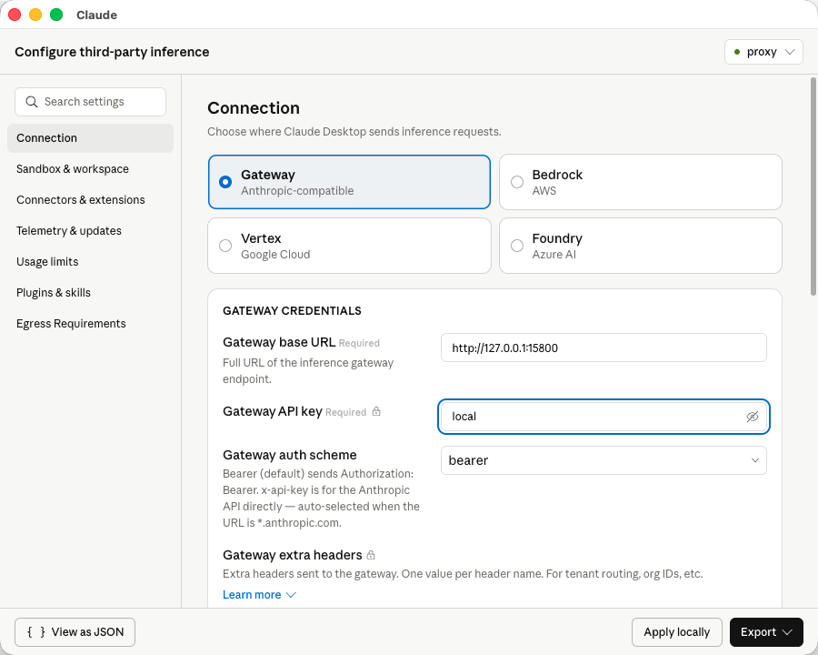
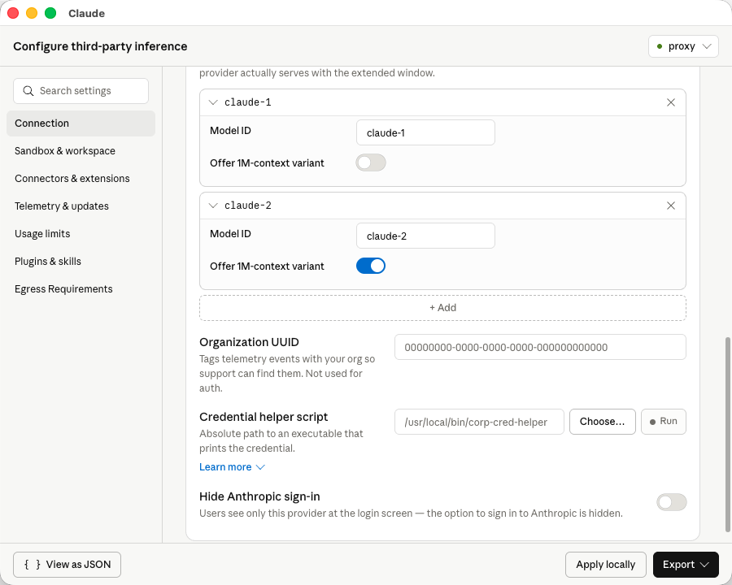
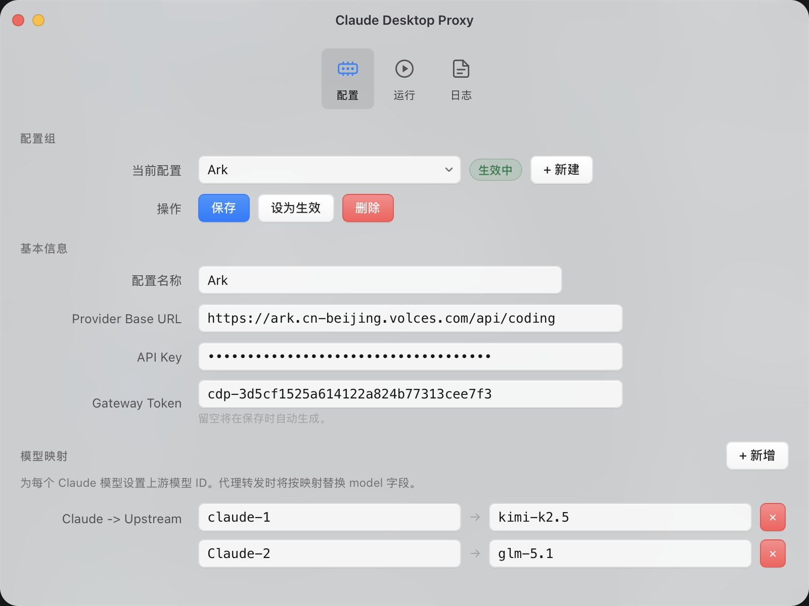
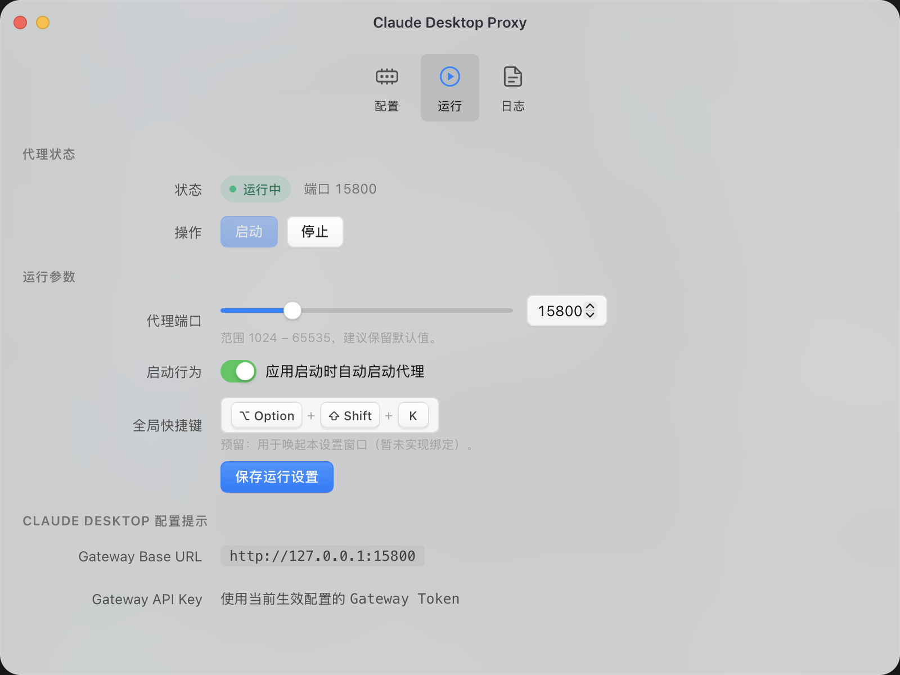

# Claude Desktop Proxy

中文说明: [README.md](./README.md) | English version: [README.en.md](./README.en.md)

Claude Desktop 的本地代理客户端（Tauri v2 + React），用于将 Claude Desktop 请求中转到第三方模型，并支持多配置组切换。


## 软件使用

1. 打开 claude desktop 的三方配置功能
2. 设置gateway
  1. Gateway base URL 配置为本软件的代理地址，一般是 http://127.0.0.1:15800
  2. Gateway API key随便填一个（这个在本软件里统一管理）
  
  3. Model list 仅用于告诉 Claude 可选模型名。建议与本软件里的 Claude 模型映射一致；默认可使用：claude-sonnet-4-6、claude-opus-4-1、claude-haiku-3-5。
  
  4. 应用到本地，软件重启。
3. 启动本软件，在这里管理你的模型组。设置真正的接口地址、api Key 以及模型映射之后，点击生效，并开启代理即可代理成功。
4. 代理转发时会严格按“Claude 模型 -> 上游模型”映射替换请求中的 model；如果请求模型未配置映射，会返回 400。




## 参与开发

### 安装依赖

```bash
npm install
```

### 本地运行（开发模式）

推荐直接使用：

```bash
npm run tauri:dev
```

### 前端单独调试

只跑前端页面：

```bash
npm run dev
```

构建前端静态资源：

```bash
npm run build
```

### 打包发布

执行：

```bash
npm run tauri:build
```

默认产物位置（macOS）：

- `src-tauri/target/release/bundle/`

### 触发流水线

```bash
# 示例
git tag v0.1.0
git push origin v0.1.0
```


### 打包产物位置

本地打包后可在以下目录找到安装程序：

- macOS: `src-tauri/target/release/bundle/dmg/`
- Windows: `src-tauri/target/release/bundle/msi/` 或 `src-tauri/target/release/bundle/nsis/`
- 通用目录: `src-tauri/target/release/bundle/`

GitHub Actions 打包完成后，安装包会上传到对应 tag 的 GitHub Releases 页面。

### 常见安装问题

1. Windows 只看到空白控制台

这是因为应用被当作控制台子系统启动。项目已在 Rust 入口增加：

```rust
#![cfg_attr(not(debug_assertions), windows_subsystem = "windows")]
```

Release 版本将不再弹出空白控制台。

2. macOS 提示“已损毁”

通常是未签名/未公证包被 Gatekeeper 拦截，不是构建产物损坏。

如果没有 Apple 开发者账号，建议优先下载 Release 中的 `.app.tar.gz`（避免使用 dmg），并在首次运行前执行：

```bash
xattr -dr com.apple.quarantine "/Applications/Claude Desktop Proxy.app"
codesign --force --deep --sign - "/Applications/Claude Desktop Proxy.app"
```

说明：

- 第一行用于移除下载隔离标记（quarantine）。
- 第二行是本机 ad-hoc 重新签名（不需要开发者账号），可降低“已损毁/无法验证开发者”提示概率。

要让 macOS 正常安装，请在仓库 Secrets 配置以下变量（工作流已支持）：

- `APPLE_CERTIFICATE`
- `APPLE_CERTIFICATE_PASSWORD`
- `APPLE_SIGNING_IDENTITY`
- `APPLE_ID`
- `APPLE_PASSWORD`
- `APPLE_TEAM_ID`

未配置上述变量时，仍可打包，但 macOS 上可能被系统阻止打开。
